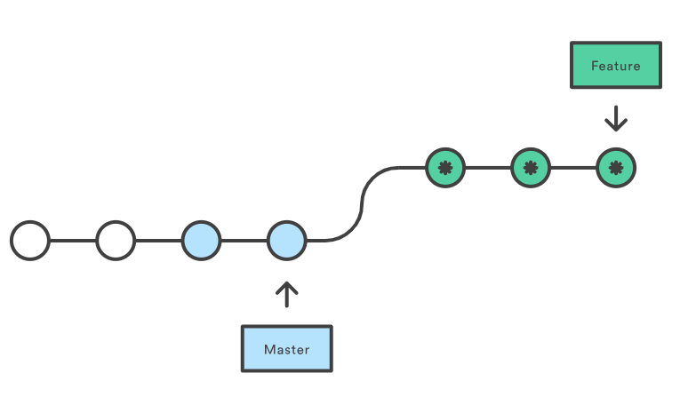
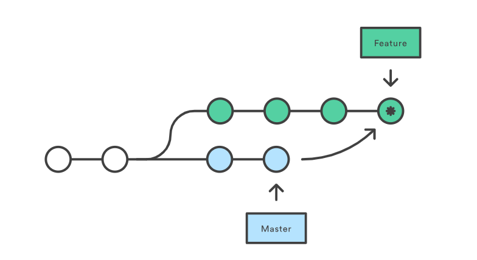

introduction-git-w3-working-with-remotes

# Introduction to Git and GitHub
## WEEK 3 - Working with Remotes

### **Introduction to GitHub**
* * *
#### *Intro to Module 3: Working with Remotes*

Elaborate with remote repository such as GitHub

#### *What is GitHub?*
We called out that Git is a distributed version control system. Distributed means that each developer has a copy of the whole repository on their local machine.
GitHub is a web-based Git repository hosting service. On top of the version control functionality of Git, GitHub includes extra features like bug tracking, wikis, and task management. GitHub lets us share and access repositories on the web and copy or clone them to our local computer, so we can work on them.
#### *Basic Interaction with GitHub*
```bash
git clone <https://github.com/sequoia/shenme.git>
```
copy repository to local machine
```bash
git push
```
to push commits from your local repo to a remote repo
```bash
git pull
```
Git pull is used to fetch the newest updates from a remote repository. If you’re making changes to a local branch while another user has also made changes to the remote branch, pull command is the answer 
It’s kind of troublesome when we had to enter username and password every time we want to push our change. To avoid this, use SSH key pair and store the public key in our profiles so that github would recognize our computer

<br/>

### **Using a Remote Repository**
* * *
#### *What is a remote?*
When we clone the newly created GitHub repository, we had our local Git Repo interact with a remote repository. Remote repository does have name though, it’s in default called as ‘origin’
#### *Fetching New Changes*
Important to know that *git fetch* fetches remote updates but doesn't merge whereas *git pull* fetches remote updates and merges. We can use *git fetch* like this to review the changes that happen in the remote repository. If we're happy with them, we can use *git merge* to integrate them into the local branch.
#### *Updating the Local Repository*
When we checking out to the branch that sit in remote repository using *git checkout <remote_branch>*, git automatically copied the contents of the remote branch into the local branch.
Or simply type *git remote update* to fetch all the contents of the remote branches, means get the contents of a remote branch without automatically merging
#### *Pushing Remote Branches*
```bash
git checkout -b <new-branch>
```
switch to newly created branch.
Before merge any of the refactor file into the master branch, we want to push it to the remote repo, so that our collaborator could know our update with *git push -u origin refactor* which u are flag for upstream, origin means remote repository, refactor is the remote branch
#### *Rebasing Your Changes*
All that left are merged back our code into the master branch. We can use git merge option or git rebase
  



rebase




merge
#### *Best Practices for Collaboration*
It's a good idea to always synchronize your branches before starting any work on your own.
Instead, try to make changes as small as possible as long as they're self-contained.
You shouldn’t rebase changes that have been pushed to remote repos
It's common practice to keep the latest version in the master branch and the latest stable version in a separate branch.
